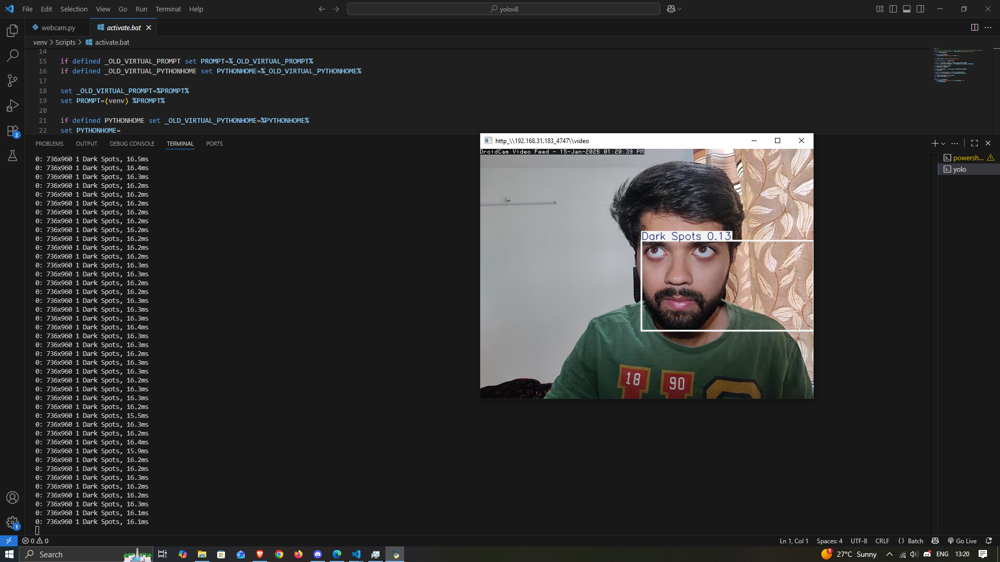

# Real-Time Deep Learning Framework for Dermatological Disease Detection and Classification

This repository implements a **real-time deep learning framework** for detecting and classifying dermatological conditions using **YOLOv8**, a state-of-the-art real-time object detection model.

The system:
- Detects skin conditions such as **Blackheads, Dark Circles, Dark Spots, Pimples, Tan, Whiteheads, Wrinkles**
- Works in **real time** using a webcam or phone camera
- Trained on a custom dataset with YOLOv8 annotations

---

## 🔍 Features

- 💡 **Real-time detection** of multiple dermatological conditions
- 📸 Supports live webcam / mobile camera detection
- 🚀 Trained with YOLOv8 for high performance
- 📊 Ready to extend to other deep learning models and datasets

---

## 🧠 Model Training

The YOLOv8 model was trained using a custom dataset structured as:

